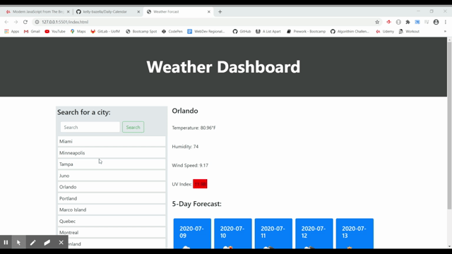

# Weather-Dashboard
The Weather-Dashboard is used to look up the weather by using the search field. 

## Features 
- UV index is shown with a color coded background depending on if it is mild, moderate, or extreme
- Search history section so the user can see the places they looked up previously

## How to Use
Input a city and you will be presented with the current weather and the 5-day forecast.

## GIF
